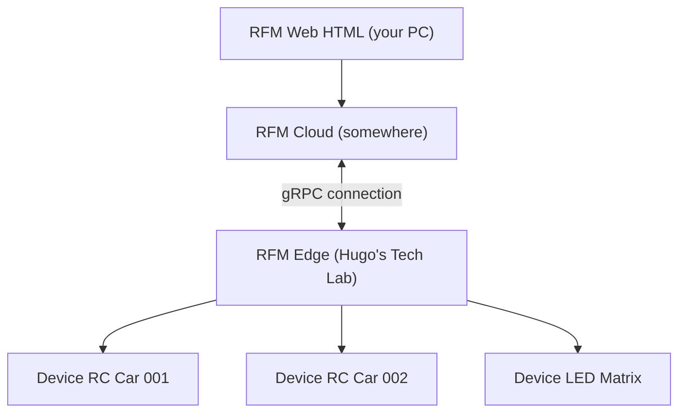

# Remote Firmware Manager (RFM)
Remotely manage software on hardware devices. Intended for the tech lab, but perhaps generic enough to find it useful for yourself too?

The repo is divided into deployable pieces of software.
- Web: the client side website / interface, which allows clients to manage hardware devices. Intended to be deployed: on your browser (i.e. by visiting https://firmware.HugosTechLab.com)
- Cloud: the "backend" code, responsible for bridging the gap between clients and hardware. Intended to be deployed: somewhere in the cloud, in some data center, likely in Germany by Hetzner.
- Edge: the server running on premise, responsible for connecting to devices locally (i.e. by wifi, bluetooth or something), modifying them and keeps the cloud up to date. Intended to be deployed: on an old PC literally in the lab, close to physical hardware.

