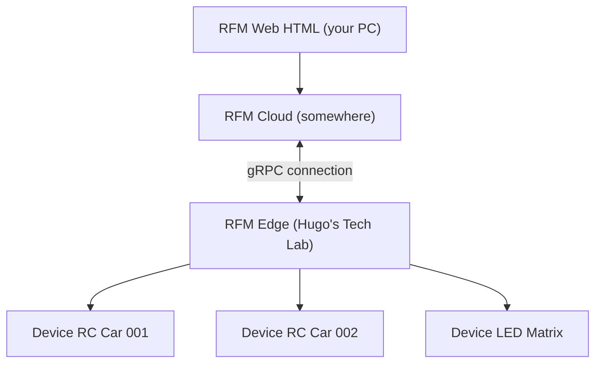

# Remote Firmware Manager (RFM)
Remotely manage software on hardware devices. Intended for the tech lab, but perhaps generic enough to find it useful for yourself too?

The repo is divided into deployable pieces of software.
- Web: the client side website to be deployed to your browser (i.e. by visiting firmware.simpleboringgames.com)
- Cloud: the "backend" code, running somewhere in the cloud, in some data center, likely in Germany by Hetzner.
- Edge: the server running on an old PC literally in my lab, close to physical hardware which we are modifiying the firmware of.

